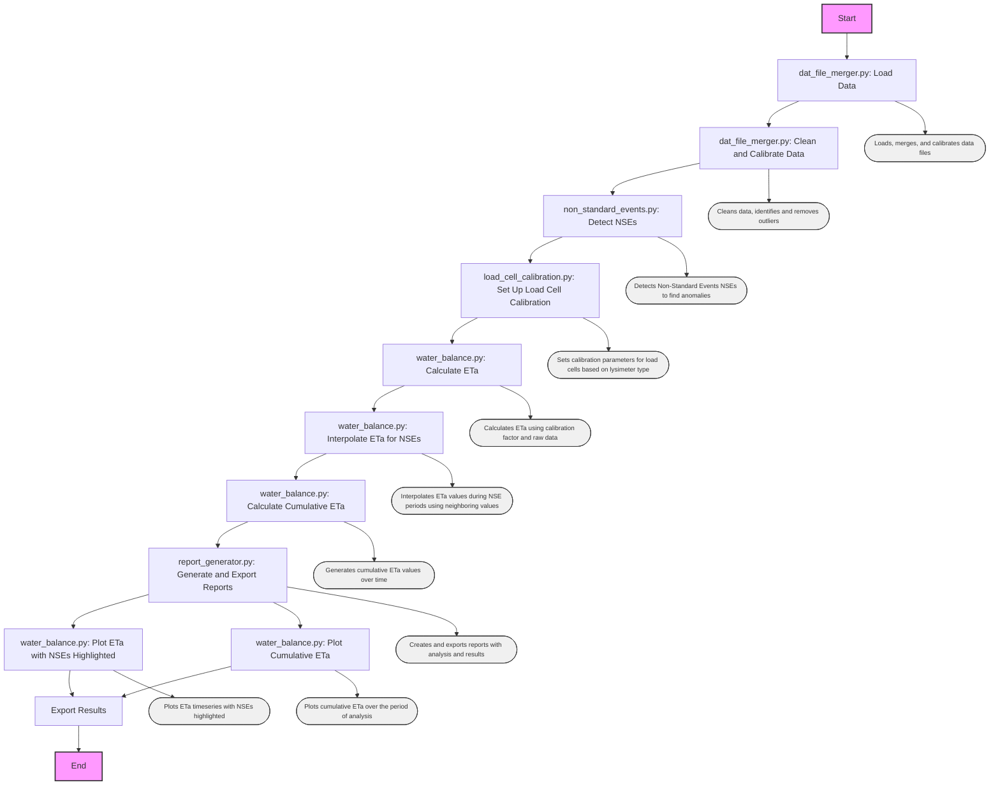

# lysimeter-data-2023
 This is a private repository made to improve the data processing of Arkansas Valley Research Center lysimeter raw data and subsequent analysis.

 Created by: 
 A.J. Brown 
 Agricultural Data Scientist 
 Colorado State Univeristy 
 Ansley.Brown@colostate.edu  
 5 April 2024

 

 > [!NOTE]
 > Please note that the data are NOT found in this repository, and only the code, which will not inform users of any data insights as a standalone. To view the data, you must have it yourself already or recieve it with special permission from Colorado State University.  Please contact me if you have a data request.

## Proposed Workflow

**Objective 1: Process 2023 data**
- AJ develop code using 2022 data where non-standard days are known, verifying that it works
- AJ apply verified code on 2023 data
- Check it against what Jeff has done so far in 2023 to validate
- If 2023 checks well, run it on remaining 2023 data that Jeff hasn't verified yet due to time constraints
- 2023 data is processed

**Objective 2: Automate the process**
- Take code and make it automated
- Idea 1: Create an .exe
    - make an .exe file that identifies and merges all .dat files in the .exe file location and exports as a csv with datetime in file name
Use windows to schedule that .exe to run at a given period (e.g., 12 hours)
- Idea 2: Use google colab
    - create a google colab notebook that does the same thing as the .exe, but has GUI components for easier user interaction
    - also prevents users from needing to download any large files

## Data Flow
**Currently**
1. Raw data files are collected from the lysimeter
2. Raw data are manually merged into single excel file
3. Data are put as raw into a data processing spreadsheet where values can be calculated
4. Non-standard events (NSEs) are identified and flagged manually upon visual inspection
5. ASCE PM ETc is estimated at the start and end of each NSE, then interpolated between those datetimes via linear model

**Proposed**
1. Raw data files are collected from the lysimeter
2. Python code merges and processes the data:
    - Finds all .dat files in the folder and merges them, then exports that as .csv with datetime for user reference
    - uses dataframe created after merge to create calculated value columns as previously done in the excel spreadsheet
    - exports the processed data as a .csv with datetime in file name
3. Identify non-standard events (NSEs) and subsequent non-standard days (NSDs) automatically
    - using guidelines provided in the documentation folder from Lane Simmons
    - create a new column in the processed data that flags NSE's and NSD's
    - it appears that identifying NSE's is more optimal than NSD's (see Lane's description in the documentation folder), so the code will be written to identify NSE's and NSD's will be investigated later if needed.
    - create graphics for manual QAQC
4. Interpolate ETc for NSEs
    - Use [PyFAO56 module from USDA ARS](https://github.com/kthorp/pyfao56/tree/main) to estimate ASCE PM ETc for all NSE flagged rows OR
    - Create a linear model to estimate ETc for NSE's by estimating ETc at the start and end of each NSE, then interpolating between those datetimes
        - this method may be optimal when the lysimeter weather station is not able to be above canopy, as the ASCE PM equation requires
5. Use lysimeter weights and ETc estimates to create a water balance

## TODO
- refine NSE detection algorithm to be more accurate
- refine NSE detection algorithm to count NSE's and define whole events
- add new ET column for NSE's using METS data
    - Option 1: use ET data found within METS dataframe inherently
    - Option 2: Use PyFAO56 (or code my own?) to estimate ASCE PM ETc for all NSE flagged rows from METS weather data
- Change everything to use 5min data instead of 15min data, or at least give the user an option.  Note: METS on ly has 5 and 60 min data
- Create water balance using lysimeter weights and ETc estimates