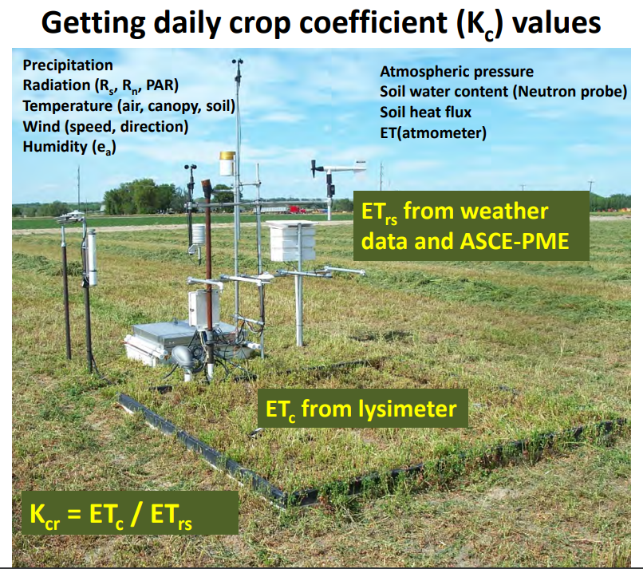
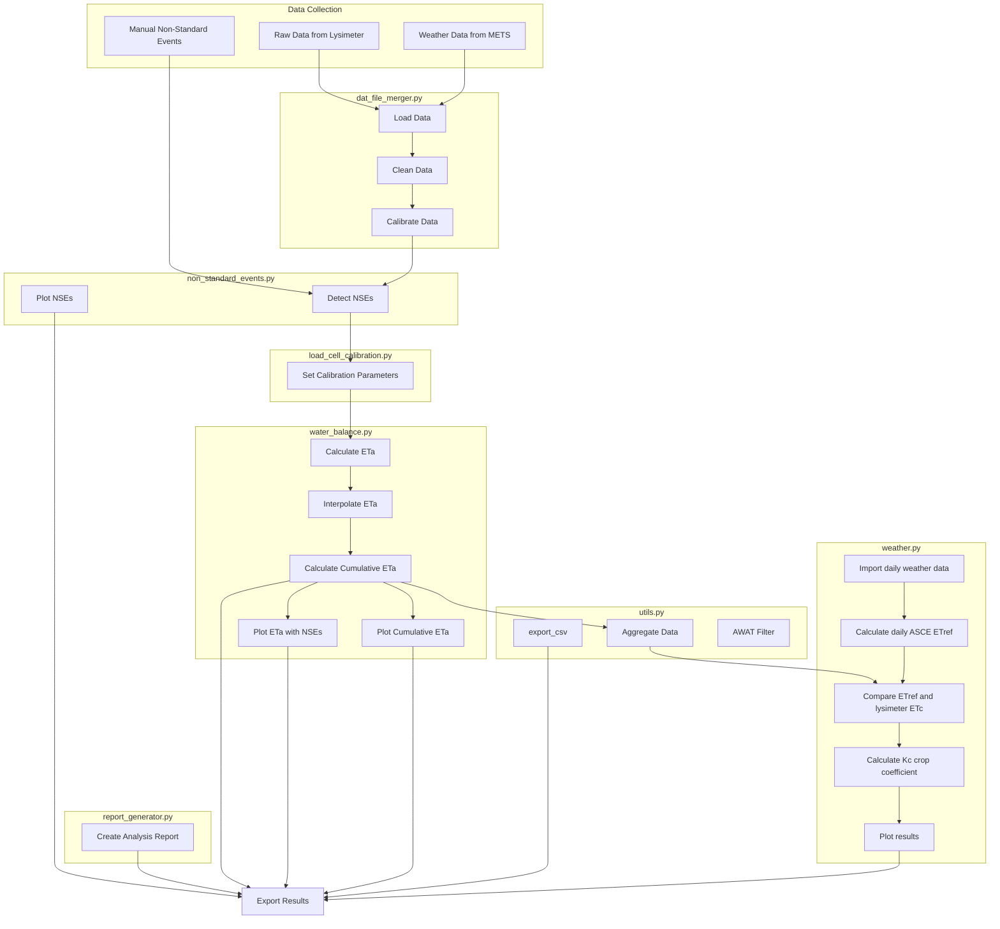

# lysimeter-analysis python module
A Python module that processes and analyzes weighing lysimeter data for quantifying crop water use (i.e., evapotranspiration).

[](https://csu-lysimeter-analysis.streamlit.app/)

 Created by:<br/>
 A.J. Brown<br/>
 Agricultural Data Scientist<br/>
 Colorado State Univeristy<br/>
 Ansley.Brown@colostate.edu <br/>
 5 April 2024

 

 > [!NOTE]
 > Please note that the data are NOT found in this repository, and only the code, which will not inform users of any data insights as a standalone. To view the data, you must have it yourself already or recieve it with special permission from Colorado State University.  Please contact me if you have a data request.

## Table of Contents

1. [Introduction](#introduction)
2. [Installation](#installation)
3. [Usage](#usage)
4. [Core Functionalities](#core-functionalities)
5. [Workflow](#workflow)
6. [Data Disclosure](#data-disclosure)
7. [References](#references)

## Introduction
Precision weighing lysimeters are advanced instruments used to measure crop water use with high accuracy. They work by continuously weighing a soil-plant system to determine the amount of water lost through evapotranspiration (ET). This data is crucial for optimizing irrigation practices, improving water use efficiency, and enhancing crop yield.

However, data generated by precision weighing lysimeters is often complex and voluminous, posing a significant barrier to their widespread use, reliability, and adoption. The intricate nature of the data requires specialized knowledge and significant time investment to analyze and interpret, which can be a deterrent for many users.

To address this challenge, this python module titled `lysimeter-analysis` simplifies the data analysis and allows users to process and interpretat lysimeter data, making it more accessible and user-friendly. The previous time required to process these data would be months, and this project uses automated methods to obtain similarly accurate information in less than a minute in most cases. By reducing the complexity and time required for data analysis, this automated process encourages the broader use of precision weighing lysimeters, ultimately contributing to more efficient and sustainable agricultural practices.

`lysimeter-analysis` processes weighing lysimeter data to quantify actual crop ET (ETc), compare it to weather data to calculate the [ASCE Penman-Monteith (ASCE-PM) reference ET](https://doi.org/10.1061/9780784408056) (ETo and ETr for short and tall crops, respectively) derived from the [pyfao56 python module](https://github.com/kthorp/pyfao56/tree/main), and determine the crop coefficient (Kc) for the given crop growing on the lysimeter. The package includes functionality for data merging, calibration, non-standard event detection, weather data processing, and report generation.

This module was created originally to serve the [Arkansas Valley Lysimeter Project](https://webdoc.agsci.colostate.edu/aes/AES/RCConf/2016/Andales2016CAESLysimeter&WISE.pdf), located at the Colorado State University (CSU) Arkansas Valley Research Center (AVRC). For more information, review [Andales *et al.* (2018)](https://www.researchgate.net/publication/324736388_Design_and_Construction_of_a_Precision_Weighing_Lysimeter_in_Southeast_Colorado).

## Installation
To use the module, ensure you have Python 3.6 or higher installed. Then, clone the repository and install the dependencies:
```bash
git clone https://github.com/{yourusername}/lysimeter-analysis.git
cd lysimeter-analysis
pip install -r requirements.txt
```

## Usage

[](https://csu-lysimeter-analysis.streamlit.app/)

See the detailed ["How-To" guide](/documentation/How%20to%20run.md) created for installing and running this script.

<!-- Alternatively, if you are not interested in coding yourself, you can find an online application here: -->

## Code Core Functionalities
1. Data Processing (`dat_file_merger.py`): Merging .dat files from different sources and aggregating them to specific timescales.

2. Calibration (`load_cell_calibration.py`): Applying calibration to the load cell data using specified coefficients (alpha and beta).

3. Non-Standard Events Detection (`non_standard_events.py`): Identifying and processing non-standard events (NSEs) such as rainfall, irrigation, etc.

4. Weather Data Processing (`weather.py`): Handling weather data for ETr calculations.

5. Water Balance Calculation (`water_balance.py`): Calculating water balance using processed lysimeter data.

6. Report Generation (`report_generator.py`): Creating reports based on the analysis, including visualizations and key metrics.

7. Utility Functions (`utils.py`): General utility functions to support the above modules.

8. Running the Analysis (`run_analysis.py`): This script ties all the above functionalities together, processing the data end-to-end based on user input parameters.

## Workflow


<!-- ## Project-Specific Objectives
**Objective 1: Process 2023 data**
- AJ develop code using 2022 data where non-standard days are known, verifying that it works
- AJ apply verified code on 2023 data
- Check it against what Jeff has done so far in 2023 to validate
- If 2023 checks well, run it on remaining 2023 data that Jeff hasn't verified yet due to time constraints
- 2023 data is processed

**Objective 2: Automate the process**
- Take code and make it automated
- Idea 1: Create an .exe
    - make an .exe file that identifies and merges all .dat files in the .exe file location and exports as a csv with datetime in file name
Use windows to schedule that .exe to run at a given period (e.g., 12 hours)
- Idea 2: Use google colab
    - create a google colab notebook that does the same thing as the .exe, but has GUI components for easier user interaction
    - also prevents users from needing to download any large files

## Data Flow
**Currently**
1. Raw data files are collected from the lysimeter
2. Raw data are manually merged into single excel file
3. Data are put as raw into a data processing spreadsheet where values can be calculated
4. Non-standard events (NSEs) are identified and flagged manually upon visual inspection
5. ASCE PM ETc is estimated at the start and end of each NSE, then interpolated between those datetimes via linear model

**Proposed**
1. Raw data files are collected from the lysimeter
2. Python code merges and processes the data:
    - Finds all .dat files in the folder and merges them, then exports that as .csv with datetime for user reference
    - uses dataframe created after merge to create calculated value columns as previously done in the excel spreadsheet
    - exports the processed data as a .csv with datetime in file name
3. Identify non-standard events (NSEs) and subsequent non-standard days (NSDs) automatically
    - using guidelines provided in the documentation folder from Lane Simmons
    - create a new column in the processed data that flags NSE's and NSD's
    - it appears that identifying NSE's is more optimal than NSD's (see Lane's description in the documentation folder), so the code will be written to identify NSE's and NSD's will be investigated later if needed.
    - create graphics for manual QAQC
4. Interpolate ETc for NSEs
    - Use [PyFAO56 module from USDA ARS](https://github.com/kthorp/pyfao56/tree/main) to estimate ASCE PM ETc for all NSE flagged rows OR
    - Create a linear model to estimate ETc for NSE's by estimating ETc at the start and end of each NSE, then interpolating between those datetimes
        - this method may be optimal when the lysimeter weather station is not able to be above canopy, as the ASCE PM equation requires
5. Use lysimeter weights and ETc estimates to create a water balance

## TODO
- ~~Calculate ETc for NSE events~~
    - ~~Option 1 (selected): linearly interpolate between ET values at start and end of NSE events~~
    - Option 2 (for later invesitgation): Use PyFAO56 (or code my own?) to estimate ASCE PM ETc for all NSE flagged rows from METS weather data
- ~~Change everything to use 5min data instead of 15min data, or at least give the user an option.  Note: METS only has 5 and 60 min data~~
- ~~Create a report generator that reports NSE detection, ETc calibration parameters, load cell calibration parameters, and any other warnings or errors worth noting~~
- ~~Import weather data, calculate reference ETr, and compare to lysimeter ETc so that a crop coefficient is calculated (Kc = ETc / ETr), then fit a polynomial curve to the Kc values for a seasonal trend.~~
- ~~create a function in utils.py that allows users to aggregate data to a different time interval (e.g., 5min to 15min to 1hr to daily etc.) and output results in that selected interval.~~
    - ~~create error if user selects timestep that is smaller than input data timestep~~
- ~~Add simulated data to put in github repo for public use, and make readme more public friendly~~
- ~~Add weather data script that calculates reference ETr and Kc values~~
    - ~~Double check that pyfao56 is working correctly~~
    - ~~manually calculate dewpoint for asce pm equation~~
- ~~add ETa and ETc comparison plots as output~~
- ~~add Kc timeseries plot as output~~
    - ~~fit with polynomial curve~~
- refine NSE detection algorithm to be more accurate
    - use AWAT filter to smooth smaller NSE events due to wind and other noise that aren't explicity irrigations, rains, etc.
- ~~remove cumulative lines on Kc and instantaneous ET plots~~
- ~~Add weather data info to report generator~~
- ~~Add manual NSE detection to report generator~~
- ~~Make NSE dots colored by NSE Type, and HoverTool to show NSE Type in plotly~~
- ~~Make front end app in streamlit or dash for other users~~
- FIX NSE INTERPOLATION
    - cumulative values used to be 820 mm ish as of 30 Aug 2024 at 12:42pm
    - after changing nse's to detect manually first then automatically, the cumulative values are now 1500! This is a huge error that needs to be fixed.
        - this only occurs on the streamlit app, but not when ran via terminal. This is likely due to the way the streamlit app is handling the data.
        - I need to integrate some sort of resetting each time the user click's run analysis, or similar.
- run code through linting and make sure it's all clean
- Perform analysis for 2022 data and compare to Lane's analysis results!
    - results 28 Aug 2024: 
        - 2022 ETr data is very similar with slight differences. Allan and I think this is due to me using the daily ASCE-PM and Lane using the hourly ASCE-PM, then aggregating to daily.
        - 2022 Kc comparisons are close, but the python-derived Kc values have considerable variance.
            - check/improve the NSE detection algorithm
            - check/improve the ETc interpolation algorithm
    - note on weather dates:
        - check if the python code ASCE-PM data are on the correct dates; the 2022 budget from lane indicates that my data is off by a day.
-->
## Data Disclosure
The data provided in this Repository is for example purposes only, and has been anonymized to prevent unintentional interpretation or use in other applications. Users are explicitly discouraged from interpreting, sharing, or using this data for applications other than illustrative or educational examples related to the Repository's described purposes. 

## References
 - (2024) Thorp, K. R., DeJonge, K. C., Pokoski, T., Gulati, D., Kukal, M., Farag, F., Hashem, A., Erismann, G., Baumgartner, T., Holzkaemper, A., 2024. Version 1.3.0 - pyfao56: FAO-56 evapotranspiration in Python. SoftwareX. In review.
 - (2005). The ASCE Standardized Reference Evapotranspiration Equation (R. G. Allen, I. A. Walter, R. L. Elliott, T. A. Howell, D. Itenfisu, M. E. Jensen, & R. L. Snyder, Eds.). American Society of Civil Engineers. https://doi.org/10.1061/9780784408056
 - Andales, Allan & Straw, Dale & Marek, Thomas & Simmons, Lane & Bartolo, Michael & Ley, Thomas. (2018). Design and Construction of a Precision Weighing Lysimeter in Southeast Colorado. Transactions of the ASABE. 61. 509-521. 10.13031/trans.12282. 
