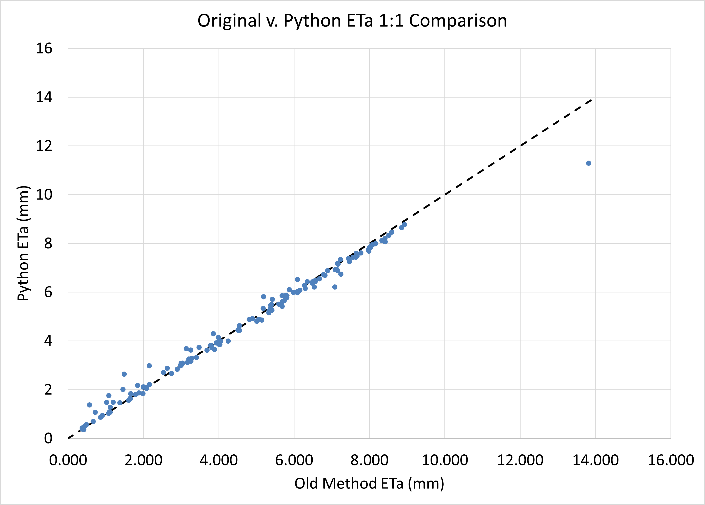

# lysimeter-analysis
> [!WARNING]
> This python module is currently in undergoing **BETA testing**, and is not ready for full-release until further validation studies are conducted. Please report any issues to the author and community using the discussion board.

A Python module that processes and analyzes weighing lysimeter data for quantifying crop water use (i.e., evapotranspiration).

[](https://csu-lysimeter-analysis.streamlit.app/)

 Created by:<br/>
 A.J. Brown<br/>
 Agricultural Data Scientist<br/>
 Colorado State Univeristy<br/>
 Ansley.Brown@colostate.edu <br/>
 5 April 2024

## Table of Contents

0. [Helpful Definitions](#helpful-definitions)
1. [Introduction](#introduction)
2. [Installation](#installation)
3. [Usage](#usage)
4. [Core Functionalities](#core-functionalities)
5. [Workflow](#workflow)
6. [Algorithm Validation](#algorithm-validation)
7. [Data Disclosure](#data-disclosure)
8. [References](#references)


## Helpful Definitions
The following is a glossary of key terms related to evapotranspiration and coefficient terminology provided by DeJonge *et al.* (2020) which are helpful for understanding the concepts discussed in the `lysimeter-analysis` documentation.


- **Evapotranspiration (ET)**: The movement of water from land and plant surfaces through two processes: evaporation from soil and water surfaces, and transpiration through plant stomata.

- **Reference Evapotranspiration (ETref)**: The rate of evapotranspiration from a hypothetical reference crop under well-watered conditions. It serves as a climatic index for estimating crop water requirements. Commonly used reference surfaces are:
  - **ETos**: Short crop (e.g., grass) reference surface.
  - **ETrs**: Tall crop (e.g., alfalfa) reference surface.

- **Crop Coefficient (Kc)**: A dimensionless factor used to estimate crop evapotranspiration (ETc) from reference evapotranspiration (ETref). The formula is:
  \[
  ETc = ETref \times Kc
  \]
  This coefficient accounts for the crop's development stage and the biological properties affecting water use.

- **Potential Evapotranspiration (ETp)**: The theoretical maximum rate of evapotranspiration when all soil and plant surfaces are wet. It is not standardized, and its use is often confused with reference evapotranspiration.

- **Transpiration Coefficient (Kcb)**: Represents the potential transpiration component of crop evapotranspiration, which is separate from the evaporation component. It is often adjusted for water stress conditions.

- **Evaporation Coefficient (Ke)**: Represents the potential evaporation from the soil surface, particularly important when the soil is bare or has minimal canopy coverage.

- **Water Stress Coefficient (Ks)**: A factor that adjusts the transpiration coefficient (Kcb) to account for reduced transpiration due to water stress conditions in the crop.


## Introduction
Precision weighing lysimeters are instruments used to measure crop water use with high accuracy. They work by continuously weighing a soil-plant system, contained within a monolith enclosed underneat the soil surface, to determine the amount of water lost through evapotranspiration (ET; Figure 1).

 
 *Figure 1: Precision weighing lysimeter at the Arkansas Valley Research Center in Rocky Ford, Colorado. The lysimeter is comprised of a monolith enclosed beneath the soil surface, which is continuously weighed to determine the amount of water lost through evapotranspiration (ET). Additionally, researchers may often install a weather station on/near the monolith for characterizing reference ET. Image Credit: Dr. Allan Andales*

However, data generated by precision weighing lysimeters are often complex, noisy, and voluminous, posing a significant barrier to their widespread use, reliability, and adoption. The intricate nature of the data requires specialized knowledge and significant time investment to analyze and interpret, which can be a deterrent for many users. One major challenge is identifying and deriving ET during non-standard events (NSEs). An NSE is any event that affects the lysimeter monolith's weight outside of the typical ET process (i.e., water leaving the monolith). Examples of NSEs include rainfall, irrigation, fertilizer application, monolith drainage, and other disturbances that can affect the lysimeter's weight at the same time that normal ET is occuring. The time and other resources needed to merge, clean, and process weighing lysimeter data *in lieu* of these NSEs can take months, and often requires a dedicated research technician for data quality assurance.

To address this challenge, this python module titled `lysimeter-analysis` simplifies the data analysis by automating NSE and noise detection, and then calculates resulting actual crop ET values from lysimeter weight data (ETa). `lysimeter-analysis` can also compare calculated ETc values to [ASCE Penman-Monteith (ASCE-PM) reference ET](https://doi.org/10.1061/9780784408056) (ETo and ETr for short and tall crops, respectively) derived from the [pyfao56 python module](https://github.com/kthorp/pyfao56/tree/main), and determine the crop coefficient (Kc) for the given crop growing on the lysimeter. The package includes functionality for data merging, lysimeter calibration, NSE detection, weather data processing, and report generation.

By reducing the complexity and time required for data analysis, this automated process encourages the broader use of precision weighing lysimeters, and lets researchers focus on obtaining meaningful results, ultimately contributing to more efficient and sustainable agricultural practices.

> [!NOTE]
> This module was created originally to serve the [Arkansas Valley Lysimeter Project](https://webdoc.agsci.colostate.edu/aes/AES/RCConf/2016/Andales2016CAESLysimeter&WISE.pdf), located at the Colorado State University (CSU) Arkansas Valley Research Center (AVRC). For more information, review [Andales *et al.* (2018)](https://www.researchgate.net/publication/324736388_Design_and_Construction_of_a_Precision_Weighing_Lysimeter_in_Southeast_Colorado).

## Installation
To use the module, ensure you have Python 3.6 or higher installed. Then, clone the repository and install the module.
```bash
git clone https://github.com/ansleybrown1337/lysimeter-analysis.git

```
Then follow the instructions on the ["How-To" guide](/documentation/How%20to%20run.md) to install the required packages and run the analysis.

> [!NOTE]
> After the authors complete the beta testing phase, the module will be available for installation via PyPI (i.e., `pip`) instead of forking this repository and using the local installation method described in the how-to guide.

## Usage
See the detailed ["How-To" guide](/documentation/How%20to%20run.md) created for installing and running this script in python via terminal commands.

Alternatively, if you are not interested in coding yourself, you can find an online application here: [](https://csu-lysimeter-analysis.streamlit.app/)

This streamlit application allows you to upload your data and run the analysis without writing any code. It is a user-friendly interface that guides you through the process of analyzing lysimeter data, using the [run_analysis.py](./code/scripts/run_analysis.py) script created in this repository as the backend.

## Code Core Functionalities
1. Data Processing (`dat_file_merger.py`): Merges .dat files containing raw lysimeter (and sometimes weather) data.

2. Calibration (`load_cell_calibration.py`): Applies calibration to the load cell data using specified coefficients (alpha and beta), converting mV/V to kg.

3. Non-Standard Events Detection (`non_standard_events.py`): Identifies non-standard events (NSEs) such as rainfall, irrigation, etc. using an automatic algorithm.

4. Weather Data Processing (`weather.py`): Uses user-provided weather data to calculate ASCE-PM ETr and derive crop coefficients from processed lysimeter data.

5. Water Balance Calculation (`water_balance.py`): Takes raw lysimeter weight data, calculates ETa from it, and interpolates over NSE events and noisy ET data.

6. Report Generation (`report_generator.py`): Creates a model run report for users to have record of parameter settings for each model run.

7. Utility Functions (`utils.py`): General utility functions to support the above modules.

8. Running the Analysis (`run_analysis.py`): This script ties all the above functionalities together, processing the data end-to-end based on user input parameters.

9. Online Application (`lysimeter_app.py`): A script that creates the online version of the `run_analysis.py` script that's user friendly and eliminates the need for python on a local device.

## Workflow

## Algorithm Validation
Using 2022 data from the CSU AVRC large lysimeter (LL), lysimeter-derived ETa values were compared from 1) the manual data cleaning process used previously, and 2) the `lysimeter-analysis` package.  Comparison results showed very strong agreement between the two methods, with root mean squared error (RMSE) values and index of agreement values of 0.324 mm and 0.999, respectively. Visually, this can be seen in the one-to-one graph presented in Figure 2.


*Figure 2: A one-to-one plot of manually- (x-axis) and python-derived (y-axis) daily cumulative ETa values in millimeters. The black dashed line is the one-to-one line and indicates perfect agreement.*

## Data Disclosure
The data provided in this Repository is for example purposes only, and has been anonymized to prevent unintentional interpretation or use in other applications. Users are explicitly discouraged from interpreting, sharing, or using this data for applications other than illustrative or educational examples related to the Repository's described purposes. 

## References
- Thorp, K. R., DeJonge, K. C., Pokoski, T., Gulati, D., Kukal, M., Farag, F., Hashem, A., Erismann, G., Baumgartner, T., & Holzkaemper, A. (2024). Version 1.3.0 - pyfao56: FAO-56 evapotranspiration in Python. *SoftwareX*, In review.

- DeJonge, K. C., Thorp, K. R., & Marek, G. W. (2020). The apples and oranges of reference and potential evapotranspiration: Implications for agroecosystem models. *Agricultural & Environmental Letters*, 5(1), e20011. https://doi.org/10.1002/ael2.20011

- Andales, A., Straw, D., Marek, T., Simmons, L., Bartolo, M., & Ley, T. (2018). Design and construction of a precision weighing lysimeter in Southeast Colorado. *Transactions of the ASABE*, 61, 509-521. https://doi.org/10.13031/trans.12282

- Allen, R. G., Walter, I. A., Elliott, R. L., Howell, T. A., Itenfisu, D., Jensen, M. E., & Snyder, R. L. (Eds.). (2005). *The ASCE Standardized Reference Evapotranspiration Equation*. American Society of Civil Engineers. https://doi.org/10.1061/9780784408056


